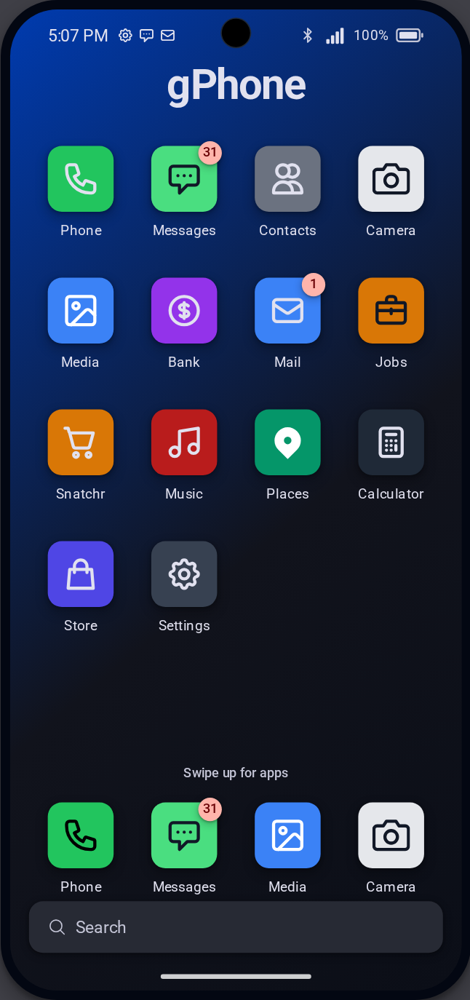
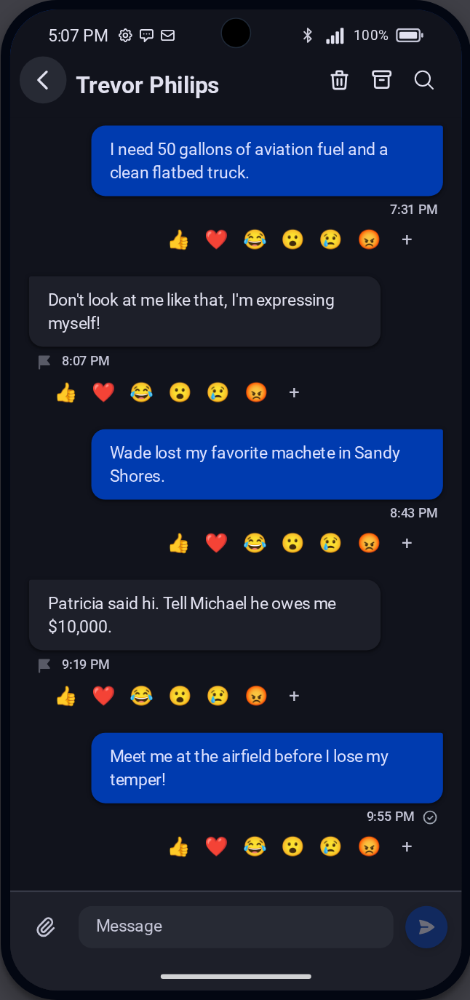
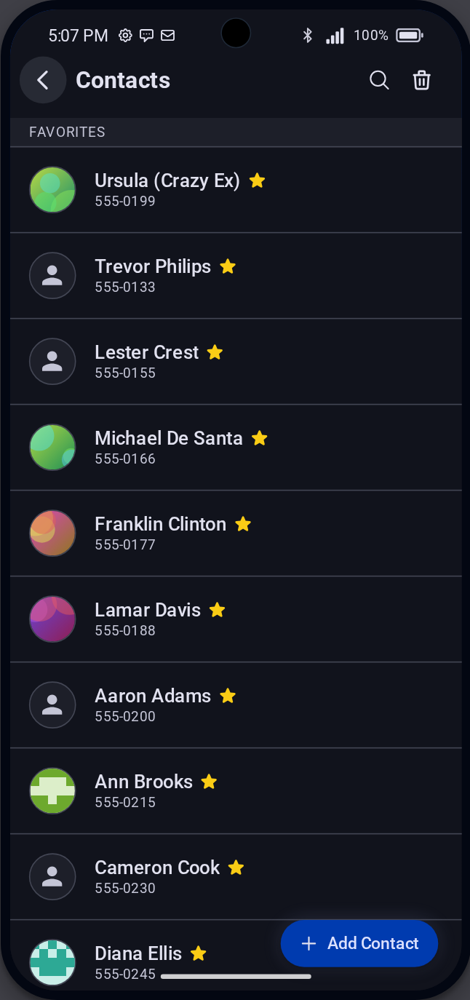
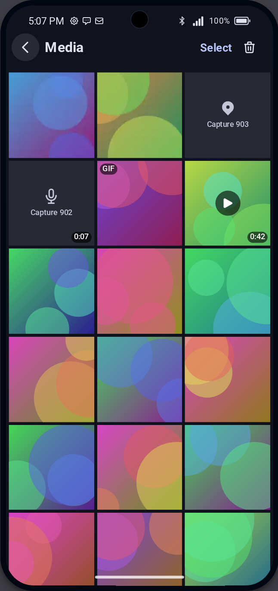
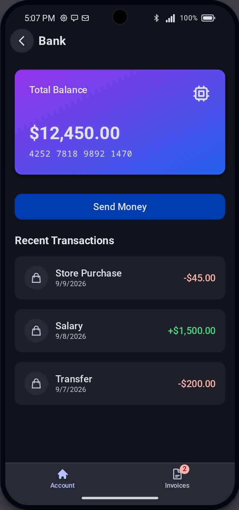
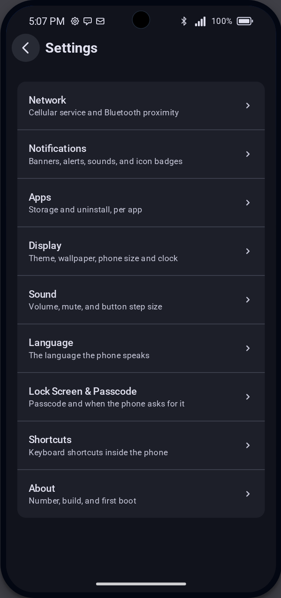
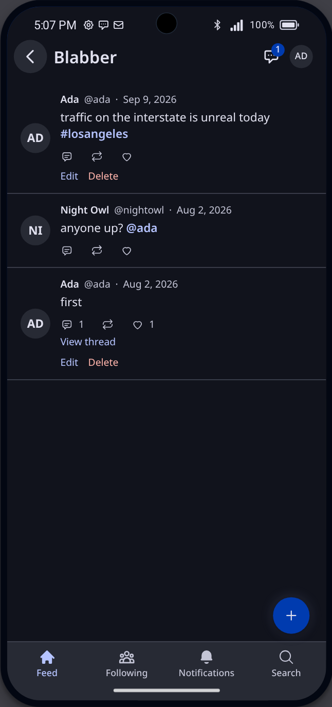

# micaOS

**A modern, open-source custom phone resource for FiveM** —
[Live Demo](https://mica.gg/) · [SDK Docs](https://docs.mica.gg/)

Powered by TypeScript, Svelte 5, Vite, and esbuild.

| Home                                      | Messages                                            | Contacts                                   | Media                                            | Bank                               | Settings                                   | Blabber                                                  |
| ----------------------------------------- | --------------------------------------------------- | ------------------------------------------ | ------------------------------------------------ | ---------------------------------- | ------------------------------------------ | -------------------------------------------------------- |
|  |  |  |  |  |  |  |

Every picture above is taken from the phone itself by
`web/e2e/screenshots.spec.ts`, against the same mock transport the e2e suite
runs on, so it cannot drift from the build. Regenerate them with
`SCREENSHOTS=1 pnpm --filter web exec playwright test e2e/screenshots.spec.ts`;
the normal suite never writes them.

---

## Overview

**micaOS** is a feature-rich, open-source smartphone resource designed for FiveM
servers. Built from the ground up using modern web technologies and a decoupled
TypeScript architecture, micaOS provides a slick, realistic mobile experience
for players and seamless framework integration for server developers.

---

## Key Features

### 📱 Applications & UI

- **Phone & Dialer**: Full contact dialing, active call management, and custom
  in-game phone prop animations.
- **Contacts**: Contact management with favoriting, custom avatars, and soft
  deletion.
- **Messages**: Individual and group messaging with support for image
  attachments directly linked to the photo gallery.
- **Mail System**: Dedicated email application with full database integration
  and unread status indicators. **Receive-only by design** — mail arrives from
  jobs, businesses and dispatches through the `SendSystemEmail` export, and
  players hold conversations in Messages instead. There is no compose or reply,
  and the server registers no action that would author one.
- **Banking**: Dynamic bank card generation based on player citizen ID, live
  balance tracking, and transfer handling.
- **Jobs**: Every job the character holds, on the framework's own multi-job
  model where it has one, with a tap to switch the active job, a duty toggle
  where the framework has duty, the society balance for a boss grade, and any
  number a job script registered as a line to call. The framework is the
  authority; the app only asks, and hides itself on a server with no framework.
- **Media & Camera**: In-game screenshot/camera integration, automatic image
  compression, gallery view, location sharing, and attachment sharing.
- **Notes**: Full-featured note-taking app with instant saving.
- **Bluetooth Proximity Sharing**: Share a contact or drop a photo to the
  nearest few Bluetooth-visible players — computed server-side from live in-game
  position, no external player list ever reaches the client. Range defaults to
  15 meters (`mica_bluetooth_range`) and one share reaches at most five people,
  nearest first (`mica_bluetooth_max_nearby`). A player turns discoverability
  off in Settings > Network; while off, they are invisible to a scan and receive
  nothing unsolicited.
- **Calculator**: Full mathematical calculator with an optimized touchscreen
  keypad layout.
- **Blabber** _(add-on)_: Short public posts under an `@handle`. Replies,
  **mouths** (a repeat, or a quote when you add your own words), likes,
  `@mention` notifications, and strictly one-to-one direct messages. Follow an
  account and its posts turn up in a Following feed of their own; the counts on
  a profile open the lists behind them. An author can fix a typo for 15 minutes
  — `mica_blabber_edit_window` — and then the post freezes. A player may hold
  several accounts and switch between them, and the owning `citizenid` never
  reaches another reader, so alts stay uncorrelated. Not on the home screen out
  of the box: it is the first genuinely non-core app and installs from the
  Store.
- **Marketplace**: Peer-to-peer classified listings — a feed with debounced
  search, a detail screen that can Call, Text or Report the seller, a create
  form capped at four photos, and a My Listings screen to mark sold or remove.
  Ships with the phone.
- **Hodlr** _(add-on)_: Trade **gCoin**, the one simulated coin. A single global
  price the server walks every 30 seconds within a $50–$5000 band, a 24-hour
  chart, and buy/sell settling against the player's bank balance. Both trades
  are atomic conditional SQL, so two concurrent taps cannot double-spend or lose
  an update.
- **Snek** _(add-on)_: The phone's game, with a leaderboard on the shared
  `highscores` service.
- **Store Application**: Built-in app marketplace to browse, install, and manage
  community add-on apps. Features Installed tab sorting (`newest`, `oldest`,
  `updated`, `name`), installation date metrics (`installedAt`, `updatedAt`), a
  permissions inspector — enforced by the host rather than documented — and app
  storage footprint metrics.
- **Admin**: Review and moderate player reports. Hidden from the home screen for
  anyone without an admin ace; the server gates the queue and every moderation
  action independently of what the UI shows.
- **Settings & Status**: Settings application with an **About** section (phone
  number, OS version, first boot timestamp, and smart git build/commit info),
  24-hour time toggles, embedded Developer Tools, dynamic battery drain
  lifecycle, and hardware controls.
- **Home Screen Edit Mode**: Right-click icon gesture to trigger Edit Mode,
  swapping unread notification badges for gray minus action buttons on removable
  add-on apps with automatic Edit Mode exit when no add-on apps remain.
- **Home Screen Layout**: Drag-and-drop icon arrangement across the grid, a
  pinned dock, a slide-up app drawer, and a first-run hint for the (empty by
  default) home screen.
- **Search**: One live search from the home screen across apps, contacts and
  messages.

### 🛠️ Backend & Core Architecture

- **SDK-First Architecture (`@mica/sdk`)**: OS hooks for data (`useContacts`,
  `useMedia`, `useMail`, `useMessages`, `useAccount`/`useAccounts`, `useCall`,
  `useReports`/`useReport`, `useMarketplace`, `useHighscores`, `useJobs`,
  `useNotifications`), for the device (`useSystemHardware`, `useClock`,
  `useDisplay`, `useCamera`, `useSound`, `useKeybinds`, `useLocation`), and for
  the app itself (`useNavigation`, `useAppLevels`, `useAppAction`, `useStorage`,
  `usePersisted`, `useTimer`, `useDeepLink`, `usePagedList`,
  `usePhoneNotification`, `useAppRegistry`, `useAppEvents`, `useTheme`,
  `useWallpaper`, `useNotificationSettings`, `useAdmin`, `useDevTools`,
  `useService`). Plus `AppProps` — the one boundary every app crosses, and
  typechecked. Apps import the SDK and nothing else, enforced by a test rather
  than documented and hoped for. A `core: false` add-on runs the SDK inside a
  sandboxed `<iframe sandbox="allow-scripts" srcdoc>`, opaque-origin and talking
  to the shell only over `postMessage`.
- **Written for app authors**: `pnpm new:app <id>` scaffolds a working app,
  `localhost:5173/?app=<id>` boots straight into one (`?device=tablet` boots the
  1280x800 tablet frame instead of the phone), and `renderApp` from
  `@mica/sdk/testing` unit-tests one. See
  [docs/writing-an-app.md](docs/writing-an-app.md).
- **Client & NUI Transport Safety**: Deterministic ID generation and 15-second
  safety timeouts (`ClientApp.ts`) preventing NUI callbacks from hanging CEF
  indefinitely.
- **Core vs. Add-on Protection Engine**: Every manifest declares `core`
  explicitly — `true` ships with the phone and cannot be uninstalled, `false` is
  a Store-managed add-on. Stated rather than inferred, because it was once
  derived from the app's `author` string, which made a display value decide
  whether an app could be removed. A remote bundle is never core.
- **App Isolation & Guardrails**: Wrapped dynamic app rendering with Svelte 5
  `<svelte:boundary>` (`ErrorBoundary.svelte`) preventing third-party app
  runtime exceptions from locking FiveM NUI mouse focus or breaking OS
  navigation.
- **Dual-Runtime Transport Abstraction**: Pluggable `ITransportAdapter` layer
  (`NuiTransportAdapter`, `MockTransportAdapter`, `WebSocketTransportAdapter`)
  cleanly separating FiveM CEF callbacks from browser mock engines and external
  WebSocket device sync.
- **In-Phone DevTools**: Embedded developer control panel in Settings app for
  browser testing (power button, volume HUD overlay, battery drain, signal
  levels, call/SMS/email simulation).
- **Click & Drag Touch/Mouse Scrolling**: Universal pointer drag-scrolling
  delegation across all phone screens and scrollable containers with hidden
  scrollbar styling.
- **Dynamic App Registry**: Reactive `appRegistryStore` supporting persistent
  `firstBoot` timestamps, app installation dates, runtime third-party app
  registration (`registerApp`, `unregisterApp`), and home screen grid updates.
- **Framework Bridge**: Built-in support for **QBX Core** (`qbx_core`),
  **QBCore** (`qb-core`) and **ESX** (`es_extended`), with automatic player
  lookup and money handlers. A framework is detected, not configured — there is
  no convar that picks one. micaOS also runs **standalone**, with no framework
  resource at all, and that mode alone is opt-in via `mica_standalone`, because
  "no framework is installed" and "the framework has not started yet" look
  identical from inside the resource. On ESX a phone belongs to the **player**
  where on a qb core it belongs to the **character**, and standalone is
  per-player as well; that and the rest of the differences are set out under
  Installation.
- **Banking Bridge**: Reads transaction history and society balances through the
  banking resource's own exports rather than its tables, normalizing each
  script's record shape onto one contract. **Renewed-Banking** (verified against
  source) and **okokBanking** (from its published export docs) provide history;
  **qb-banking** and **ox_banking** are detected but publish no export for their
  statements, so the Bank app says "history not available" and names the script
  rather than showing an empty list. Society balances come from Renewed-Banking,
  qb-banking or qb-management. No supported resource at all is said once at
  start (`mica: banking bridge -> …`).
- **Declarative Server Schema**: Each app declares its server half once via
  `defineService` — the schema drives the SQL identifier allowlist, the
  client-writable field set, and the generated DDL in `mica.sql`, so they cannot
  drift apart.
- **Inventory Integration**: Out-of-the-box support for `ox_inventory` item
  registration and removal.
- **Central Audit Logging**: Comprehensive action auditing (`mica_audit_logs`)
  tracking archive, deletion, moderation, and participant events.
- **Animation & Control**: Client-side animation, camera capture, and freelook
  camera systems.

---

## Tech Stack

- **Frontend**: [Svelte 5](https://svelte.dev/) — runes for component-local
  state only; global state is `writable`/`derived` **stores**, one file per
  domain, in `web/src/services/` (server-backed caches) and
  `web/src/shell/state/` (state the phone itself owns).
  [Vite](https://vitejs.dev/), hand-written CSS (Material 3 tokens + a utility
  layer), [TypeScript 6](https://www.typescriptlang.org/). Tested with
  [Playwright](https://playwright.dev/) (E2E) and [Vitest](https://vitest.dev/)
  (unit).
- **Backend (Client/Server)**: TypeScript 7 compiled via high-performance
  `esbuild` pipeline (8–12x typecheck speedup)
- **Runtime transport**: a pluggable `ITransportAdapter`
  (`web/src/nui/transport.ts`) — `NuiTransportAdapter` talks to FiveM's CEF over
  `fetch()`/`window.message`, `MockTransportAdapter` answers from fixtures in a
  plain browser, and `WebSocketTransportAdapter` is available for
  remote-device/external sync, with reconnection and request timeouts built in.
- **Database**: MySQL / MariaDB via `oxmysql` with foreign keys, compound
  indexes, and status moderation
- **Package Manager**: `pnpm` Workspaces — `web/` is a separate pnpm package
  (and pinned to TypeScript 6) so its typechecking tool, which needs an older
  compiler API, can stay on a different TS version than `client/`/`server/`
  (TypeScript 7) without either side compromising; see
  [AGENTS.md §3](AGENTS.md#3-typescript-is-split-by-package--on-purpose).

---

## Requirements

Before installing, ensure your server environment meets the following
requirements:

- **FiveM Artifacts**: a recent recommended server build. The resource declares
  `node_version '22'`, so the artifact has to be new enough to carry Node 22
- **Dependencies**:
  - `oxmysql`
  - Framework: `qbx_core`, `qb-core`, or `es_extended` — see the note on ESX
    below before installing on the last of these. **Optional**: micaOS also runs
    with no framework at all, which you turn on deliberately with
    `mica_standalone`. See "Running with no framework" below for what that mode
    costs you.
  - _(Optional)_ `ox_inventory`

**No toolchain.** A release zip is prebuilt, and nothing on that list is Node or
pnpm. Node.js 26 and pnpm 11 are needed only to build from source, under "From
source" below, which is for changing the phone rather than running it.

---

## Installation & Setup

<!-- release-zip:start -->

1. **Download the release.** Every GitHub release attaches `mica-<version>.zip`,
   built by CI from the tagged commit. Unpack it into your server's `resources`
   directory: it unpacks to a single `mica` folder (for example
   `resources/[standalone]/mica`) holding the manifest, the built bundles, both
   schema files, the licence and a README.

   The release also carries `SHA256SUMS` and a signed provenance attestation, so
   you can check the zip is the one CI built rather than a copy something else
   has touched:

   ```sh
   sha256sum -c --ignore-missing SHA256SUMS
   gh attestation verify mica-<version>.zip --repo quissicutdeus/mica
   ```

2. **Database Setup — and there are two schema files, one per framework.** On
   qbx_core or qb-core import [`mica.sql`](mica.sql). On es_extended import
   [`mica.esx.sql`](mica.esx.sql). Both are generated by `pnpm generate:sql`,
   both create the same twenty-nine tables, and importing the wrong one fails at
   the first foreign key rather than quietly producing a half-working phone.

   **On a qb core, import the framework's schema first.** Twenty-two of the
   twenty-nine tables in `mica.sql` carry a foreign key onto `players`
   (`citizenid`), which belongs to qbx_core or qb-core and which `mica.sql` does
   not create. That is how a deleted character takes its phone data with it
   rather than leaving orphaned rows behind. Run it against a database that has
   no `players` table and the first of those constraints fails with a
   foreign-key error part-way through the file. The tables above it are already
   created by then, so importing the framework and re-running `mica.sql` is the
   fix and costs nothing — every statement is `CREATE TABLE IF NOT EXISTS`. The
   error is easy to misread as a broken file; it is a missing prerequisite.

   **The framework's `players` table also has to share micaOS's collation.**
   `mica.sql` creates every table `COLLATE = utf8mb4_unicode_ci`, and a foreign
   key requires both sides of the relationship to collate the same way. MariaDB
   11.4 and newer changed its own default `utf8mb4` collation to
   `utf8mb4_uca1400_ai_ci`, so a `players` table created without an explicit
   collation on a recent MariaDB mismatches micaOS's, and the import fails
   partway through — some tables created, then a hard stop — with:

   ```text
   errno: 150 "Foreign key constraint is incorrectly formed"
   ```

   That message names neither collation nor `players`, which is what makes it
   worth searching for. The fix is to recreate (or
   `ALTER ... CONVERT TO CHARACTER SET utf8mb4 COLLATE utf8mb4_unicode_ci`) the
   framework's `players` table so it collates `utf8mb4_unicode_ci` before
   re-running `mica.sql`. `micaschema apply` checks for this same mismatch
   itself before touching the database, and refuses with a message naming the
   actual table and both actual collations rather than letting this error
   surface unexplained a second time.

   **`mica.esx.sql` carries none of those foreign keys**, because ESX has no
   `players` table to point them at — it identifies players in `users`, by
   `identifier`. It therefore has no prerequisite beyond an empty database, and
   no cascade either. What that costs you is under **Housekeeping on ESX**
   below, and it is the one thing on this page an ESX operator should not skip.

   It is **generated** by `pnpm generate:sql` from each app's `defineService`
   declaration, which is the single source of truth: the same declaration drives
   the SQL identifier allowlist that guards against injection, so a second
   hand-maintained copy of the DDL would not just drift, it would quietly weaken
   that guard.

   Every statement is `CREATE TABLE IF NOT EXISTS`, so re-importing is harmless
   — and does nothing to a table that already exists. micaOS applies no schema
   changes automatically: `micaschema` in the server console reports any
   difference between the database and what the code expects, and
   `micaschema apply` — console-only — applies the safe, additive half of that
   difference plus any pending versioned migration. A rename, a retype or a drop
   still needs its migration written and reviewed first; `apply` only ever runs
   migrations that already exist in `server/migrations/`.

   **Resetting the schema during development:** `pnpm generate:sql:reset`
   additionally writes `sql/dev-reset.sql`, which **drops every `mica_`-prefixed
   table in the schema you run it against** — including the audit ledger — and
   then recreates everything. It discovers tables from `information_schema` at
   apply time, so it also clears orphans left behind by a renamed table.

   Development only, and never run against a live server. It is gitignored and
   is not produced by plain `pnpm generate:sql`.

3. **Resource Manifest** Ensure `mica` is started in your `server.cfg`:

   ```cfg
   ensure oxmysql
   ensure qbx_core # or qb-core, or es_extended; omit it to run standalone
   ensure mica
   ```

<!-- release-zip:end -->

### From source

`dist/` is not in the repository, so a clone is not yet a resource. Building one
needs Node.js 26 and pnpm 11:

```sh
git clone https://github.com/quissicutdeus/mica.git mica
cd mica
pnpm install --frozen-lockfile
pnpm build
```

Then follow steps 2 and 3 above with that directory in `resources`. The build
regenerates `fxmanifest.lua` and writes `dist/`; `pnpm generate:sql` regenerates
both schema files after a change to a service declaration. The release zip is
exactly this output, packed by `scripts/pack-resource.js` from the tagged
commit, so building from source buys nothing unless you mean to change the
phone.

### Housekeeping on ESX

Five differences an ESX operator will meet, none of which has a convar and most
of which are consequences of the identity mapping rather than gaps waiting to be
filled.

**A phone belongs to the player, not the character.** micaOS keys every row on
`citizenid`, and on ESX that column holds the player's own `identifier` — the
`license:` or `steam:` string. ESX issues one per account where a qb core issues
one per character, so every character a player has shares one phone: one contact
list, one inbox, one gallery. This is intended.

**Cleanup after a deleted character is an orphan sweep here, not a cascade.** On
a qb core the `ON DELETE CASCADE` above clears twenty-two tables for free.
`mica.esx.sql` has no cascade — there is no `players` table to point one at — so
on ESX the sweep at every resource start is the whole mechanism rather than a
backstop. It asks `users(identifier)` who exists and deletes the rows belonging
to characters who do not.

**It refuses to run rather than guess, and you will see it say so.** Treating an
owner table it cannot read as "everybody is an orphan" would delete your
database, so the sweep skips and logs a reason whenever it cannot prove what it
is about to delete: no framework has answered yet, `users` is empty or
unreadable, or none of the identities sampled from micaOS's own rows exist in
`users` at all. That last one is the guard for a box with a leftover `players`
table from a previous qb install. Each prints one line naming the reason, and
each is a refusal rather than a result — a skipped sweep leaves rows behind, it
never removes extra ones. The sweep also logs a line when it starts and a line
when it finishes, including when it removed nothing, so "it ran and found
nothing" is distinguishable from "it never got as far as the database".

**A deletion flow can reclaim the space immediately** by triggering the server
event `mica:server:shell:characterDeleted` with the identifier, which removes
that character's rows from every table at once instead of waiting for the next
restart. `mica:server:media:characterDeleted` still exists and still does
exactly what it always did — media only. Both are local server events: another
resource can fire them, a game client cannot.

**Phone numbers are not part of core ESX.** There is no `charinfo`. micaOS looks
for `phoneNumber`, `phone_number` or `phone` on the player object and reports no
number when it finds none, so a phone-number resource that stores it anywhere
else leaves players without a number and without number-based lookup. Names
degrade more gently: `esx_identity`'s first and last name are used when present,
otherwise the framework's own `getName()` split at the first space.

**An offline player resolves by identifier, and by phone number when `users`
carries one.** micaOS reads es_extended's own `users` table for someone who is
not connected, so an offline player renders with their name as they would on a
qb core. Core `users` has no phone column; the resources that add one call it
`phoneNumber`, `phone_number` or `phone`, so at start micaOS asks the database
which of those three the table actually has and reads by that one, saying which
in the console
(`es_extended: offline lookup by phone number reads users.phone_number`). A
`users` with none of them means an offline player is found by identifier only —
mail to a number nobody online holds does not deliver, and `GetCitizenId(phone)`
answers `unknown_player` — and the console says that too. A resource that keeps
the number in its own table rather than on `users` is not read; micaOS declines
to guess at another project's schema.

That read degrades rather than throws. `users` is a table micaOS neither creates
nor migrates, so if it is missing a column your build does not have, the lookup
returns nothing — a nameless offline player, which is exactly the behaviour
before it existed — instead of failing the conversation being built around it.
It logs once per distinct failure per resource start, so a genuinely broken
table says so without filling your console.

**Other resources may not see the battery level.** micaOS mirrors a player's
charge onto the framework player object so other scripts can read it. ESX Legacy
1.10+ takes that mirror exactly as a qb core does. Older builds accept it only
as a session value that does not survive a reconnect, and a build offering
neither drops it and warns once per resource start — once for the server, not
once per player, since it is a property of the build rather than of anyone
playing on it. The phone is unaffected in every case — micaOS's own
`mica_battery` table is the source of truth and is written either way — so what
degrades is a third-party integration reading the mirror, never the battery
itself.

---

### Running with no framework

Set `set mica_standalone 1` and micaOS runs with no framework resource at all.
Import [`mica.esx.sql`](mica.esx.sql) rather than [`mica.sql`](mica.sql): the
two differ only in the foreign keys onto qb's `players` table, and a standalone
server has no such table for them to point at.

**Identity is the player's `license:` identifier**, read from the FiveM runtime.
A phone therefore belongs to the **player**, exactly as it does on ESX — one
phone per person rather than one per character. Rows written in this mode do not
carry over if you later install a framework: a license identifier and a qb
`citizenid` are different strings, so moving between them is a data migration
and not a config change.

**micaOS issues the phone numbers**, because there is no framework to issue
them. A number is generated at random on a player's first connection, stored in
`mica_phone_numbers`, and stays with them across reconnects — every contact
anyone had saved would break otherwise. The same table records every number on a
qb core too, mirrored into `charinfo.phone` (see "A number belongs to the phone"
under the phone-as-item section); on ESX it stays empty and the framework's own
number is used exactly as before.

**There is no money, and the apps that need it are hidden rather than broken.**
Bank and Hodlr do not appear on a standalone server. That is deliberate: a Bank
that is present and errors on every tap is worse than one that is not there.
Marketplace is unaffected — it never moved money in the first place, and its
buyers and sellers settle in-world.

**Metadata mirroring degrades.** `setMeta` has no framework player to write to,
so it is dropped and reported once per resource start. micaOS's own tables are
untouched — the battery level lives in `mica_battery` either way — so what is
lost is visibility to _other_ resources, never the phone's own state.

**Offline players are looked up from micaOS's own table**, as there is no
`players` or `users` table to read. Somebody micaOS has never seen has no name
and no number, which is the same degraded-but-working answer ESX already gives
for a phone number.

**The orphan sweep does not run.** It removes micaOS rows whose character no
longer exists, and it answers that question against the framework's own table.
Standalone has none, so the sweep skips rather than guessing — and a sweep that
guessed wrong here would delete the entire phone database.

### Coming from qb-phone

Hundreds of qb-core scripts mail or notify the phone by firing qb-phone's own
net events, and a server replacing qb-phone should not have to edit them. Net
events are global rather than keyed by resource, so micaOS listens for the ones
those scripts fire and answers them itself, with the payload shapes they already
send. Nothing to configure; the server console says what is answered at start:

```text
[mica] answering qb-phone events: qb-phone:server:sendNewMail, qb-phone:server:sendNewMailToOffline, qb-phone:client:CustomNotification
```

| qb-phone event                         | Fired as                                                                   | Becomes                                                                          |
| -------------------------------------- | -------------------------------------------------------------------------- | -------------------------------------------------------------------------------- |
| `qb-phone:server:sendNewMail`          | `TriggerEvent(name, { sender, subject, message })`, player as `source`     | Mail to that player, through `SendSystemEmail`                                   |
| `qb-phone:server:sendNewMailToOffline` | `TriggerEvent(name, citizenid, { sender, subject, message })`, server only | Mail to that citizen, online or off                                              |
| `qb-phone:client:CustomNotification`   | `TriggerClientEvent(name, src, title, text, icon, color, timeout)`         | The shell's toast, with the title and text. Icon, colour and timeout are dropped |

What is deliberately different from qb-phone:

- **`sendNewMailToOffline` is a local event here, not a net event.** qb-phone
  registered it so that any client could name any citizenid; micaOS answers it
  only from another server resource. A script firing it from the server, which
  is what every one of them does, notices nothing.
- **`sendNewMail` mails the `source`, and only the `source`.** A client can fire
  it and gets mail to itself, rate limited like every other raw net event. A
  server script firing it outside a player's own event context has no `source`
  to speak of and mails nobody; use the offline form with a citizenid instead.
- **A qb mail `button` is dropped.** micaOS's Mail has no client event to fire
  when a mail is tapped. The mail arrives; the button does not.
- **Everything else with the `qb-phone:` prefix is not answered**, and cannot be
  reported: an event nobody listens for never reaches this resource. Calls,
  adverts, tweets, garage lists and the like are qb-phone's own UI talking to
  its own server half, and micaOS has its own shape for each. A script that used
  qb-phone's QBCore callbacks (`qb-phone:server:GetCallState` and its kind)
  needs the corresponding export from the table above instead.

## Configuration

Everything a server owner can tune is a convar, set in `server.cfg` above
`ensure mica`. Most are read on the server, so plain `set` is enough. **Five are
worth `setr`**, because a client reads them and a plain `set` never leaves the
server — though for one of them, `mica_disabled_apps`, only the client's own
`OpenApp` export depends on it; see below:

- **`mica_music_range`** — both halves of proximity music read it: the server to
  decide who is on a listener's roster, the client to decide what that roster
  sounds like. A plain `set` leaves every client on the default while the server
  fans out at your value.
- **`mica_camera_quality`** — the photo is encoded in the phone's own UI, which
  cannot read a convar at all, so the client reads it and hands it over. A plain
  `set` leaves every photo at the default.
- **`mica_addon_hosts`** and **`mica_addon_catalog`** — the Store's install path
  lives entirely in the phone's UI, for the same reason. A plain `set` leaves
  every phone with an empty allowlist, which means every install is refused.
- **`mica_disabled_apps`** — the client's own `OpenApp` export checks the convar
  locally, ahead of the round trip that would otherwise refuse it. With a plain
  `set` it cannot read the list, so it answers `ok()` for an app the shell still
  refuses once its NUI message arrives — the phone lands on its home screen, not
  the app, exactly as it would for any other disabled id. `setr` only changes
  what the export itself reports.

The values below are the defaults as written in the code, so a server that sets
none of them behaves exactly as shown and this block is only worth pasting if
you intend to change something.

```cfg
set mica_standalone ""
set mica_phone_item ""
set mica_battery_item "battery_bank"
set mica_battery_item_charge 100
set mica_admin_aces "mica.admin,command"
set mica_rate_limit 60
set mica_lockscreen_scrypt_cost 16384
set mica_lockscreen_max_attempts 5
set mica_source_url "https://github.com/quissicutdeus/mica"
set mica_locale "en"
set mica_bank_transfer_max 50000
set mica_hodlr_trade_max 50000
set mica_hodlr_spread_pct 2
set mica_emergency_number "911"
set mica_max_accounts_per_app 3
set mica_bluetooth_range 15
set mica_bluetooth_max_nearby 5
setr mica_music_range 30
set mica_music_max_nearby 8
setr mica_camera_quality 95
set mica_blabber_edit_window 900
set mica_notification_retention 30
set mica_restore_window_days 30
set mica_media_quota_mb 64
set mica_media_retention 0
set mica_orphan_owner_table ""
setr mica_addon_hosts ""
setr mica_addon_catalog ""
set mica_discord_webhook ""
set mica_discord_webhook_payment_min 10000
set mica_discord_webhook_content ""
setr mica_disabled_apps ""
set mica_default_dock ""
set mica_default_contacts ""
```

| Convar                             | Type                                | Default               | Controls                                                         |
| ---------------------------------- | ----------------------------------- | --------------------- | ---------------------------------------------------------------- |
| `mica_standalone`                  | boolean                             | empty (off)           | Run with no framework resource at all                            |
| `mica_phone_item`                  | item name                           | empty (off)           | Gate the phone on holding this inventory item                    |
| `mica_battery_item`                | item name                           | `battery_bank`        | Item that recharges the phone; empty turns it off                |
| `mica_battery_item_charge`         | integer, 1-100                      | `100`                 | Percent one use of that item adds                                |
| `mica_admin_aces`                  | comma-separated aces                | `mica.admin,command`  | Who counts as a micaOS admin                                     |
| `mica_rate_limit`                  | integer                             | `60`                  | Requests per player, per action, per minute                      |
| `mica_lockscreen_scrypt_cost`      | power of two                        | `16384`               | Lock screen passcode hashing cost — lower on weak hardware       |
| `mica_lockscreen_max_attempts`     | integer                             | `5`                   | Wrong passcodes before a one-minute lockout                      |
| `mica_source_url`                  | https:// URL                        | this repository       | Where Settings > About > License says your source lives          |
| `mica_locale`                      | BCP 47 language tag                 | unset                 | The phone's default language; players can override it            |
| `mica_bank_transfer_max`           | integer                             | `50000`               | Ceiling on one player-to-player send                             |
| `mica_invoice_expiry_days`         | integer                             | `7`                   | Days an unpaid invoice stays payable before it lapses            |
| `mica_hodlr_trade_max`             | integer                             | `50000`               | Ceiling on what one Hodlr buy or sell is worth                   |
| `mica_hodlr_spread_pct`            | number, percent                     | `2`                   | Gap between Hodlr's buy and sell quotes, around mid              |
| `mica_emergency_number`            | phone number                        | `911`                 | Always connects, regardless of any block                         |
| `mica_max_accounts_per_app`        | integer                             | `3`                   | Identities one player may hold in one social app                 |
| `mica_bluetooth_range`             | integer, meters                     | `15`                  | How far a proximity share reaches                                |
| `mica_bluetooth_max_nearby`        | integer                             | `5`                   | How many phones one proximity share reaches                      |
| `mica_music_range`                 | integer, meters                     | `30`                  | How far music from a phone is heard (needs `setr`)               |
| `mica_music_max_nearby`            | integer                             | `8`                   | Broadcasters one listener is told about at once                  |
| `mica_blabber_edit_window`         | integer, seconds                    | `900`                 | How long a Blab stays editable by its author                     |
| `mica_notification_retention`      | integer, days                       | `30`                  | How long notification rows are kept                              |
| `mica_restore_window_days`         | integer, days                       | `30`                  | How long a deleted Contact/Note/Media stays restorable           |
| `mica_camera_quality`              | integer, 1-100                      | `95`                  | Encode quality of a stored photo (needs `setr`)                  |
| `mica_media_quota_mb`              | integer, MiB                        | `64`                  | Storage one player's photo library may occupy                    |
| `mica_media_retention`             | integer, days                       | `0` (off)             | How long stored media is kept, if you want a limit               |
| `mica_orphan_owner_table`          | `table.column`                      | empty (off)           | Overrides which table the orphan sweep checks against            |
| `mica_addon_hosts`                 | hostname list                       | empty (off)           | Hosts a Store add-on may be fetched from                         |
| `mica_addon_catalog`               | https URL                           | empty (off)           | The add-on catalog the Store lists                               |
| `mica_discord_webhook`             | https URL                           | empty (off)           | Discord webhook that receives moderation events                  |
| `mica_discord_webhook_payment_min` | integer                             | `10000`               | Smallest payment the webhook is told about                       |
| `mica_discord_webhook_content`     | boolean                             | empty (off)           | Let moderation reasons and report notes reach Discord            |
| `mica_disabled_apps`               | comma-separated app ids             | empty (off)           | Hide apps everywhere in the UI; blocks a handful server-side too |
| `mica_default_dock`                | comma-separated app ids, positional | empty (built-in dock) | Dock a phone starts with, until its player rearranges it         |
| `mica_default_contacts`            | JSON array, or a path to one        | empty (off)           | Contacts seeded once into every new phone                        |

Twenty of the twenty-four are read on every use rather than cached, so changing
one with `set` from the live console takes effect on the next request and needs
no restart. `mica_blabber_edit_window` and `mica_notification_retention` are
read once at resource start, so a change to either needs a restart, for the
reasons given under them below. `mica_media_retention` and
`mica_orphan_owner_table` are the third and fourth exceptions and the mildest:
both are read whenever the orphan sweep runs, which is at resource start and
again on `micamedia prune`, so a change to either takes effect on the next sweep
rather than needing a restart. `mica_camera_quality` is read on every use as
well, but the phone only asks for it when the Camera app comes to the
foreground, so a change reaches a player the next time they open the camera
rather than the next time they take a photo. `mica_addon_hosts` and
`mica_addon_catalog` are the same shape: read whenever asked for, and asked for
once, when a player's phone UI loads — so a change reaches them when they next
reconnect. `mica_disabled_apps` and `mica_default_dock` are the same shape
again: both are answered once, together, by `shell:ownerConfig` when a phone
loads, so a change to either reaches a player on their next reconnect too.
`mica_default_contacts` is read only when seeding a brand-new phone, so a change
to it affects phones created after the change, never one already seeded — but
that is only true of the convar's own value. When it points at a file, the
resolved contacts are memoized against that value (`contactsMemo` in
`server/lib/ownerConfig.ts`), so editing the file's contents without changing
the convar is invisible until the resource restarts.

- **`mica_standalone`** — run micaOS with no framework resource at all. Off by
  default, and the only convar here that changes where micaOS's _identity_ comes
  from, which is why it is opt-in rather than inferred. micaOS cannot tell "this
  server has no framework" apart from "the framework has not started yet": FiveM
  starts resources in `server.cfg` order, `ensure mica` above `ensure qbx_core`
  is a legal config, and a resource that is not yet running answers an export
  probe exactly the way one that does not exist does. Guessing standalone on a
  qb server would key that server's rows on license identifiers instead of
  citizenids — a silent identity switch on a live database — so micaOS waits to
  be told instead. Setting it while a qb or ESX core is present is a
  misconfiguration rather than an override: the real framework wins and micaOS
  says so once in the console, rather than quietly picking one. A value that is
  neither on nor off (`1`/`true`/`yes`/`on` against
  empty/`0`/`false`/`no`/`off`) is read as off and reported once, because
  `set mica_standalone yes-please` is an operator who meant to enable this and
  has not.
- **`mica_admin_aces`** — which ace objects grant micaOS admin: the phone's
  Developer Tools, and the `mica*` console commands. The default recognises two,
  and the second is the interesting one. `command` is the near-universal proxy
  for "runs this server" (`add_ace group.admin command allow`), so an owner who
  is already a full admin is not asked to grant themselves a second,
  phone-specific ace before the phone will believe them — but that convenience
  is not free. micaOS admin includes the pending report queue, which has no
  console equivalent, and its previews include excerpts of private messages and
  DMs (`mica_messages` and `mica_blabber_dms` are both reportable, alongside
  listings, accounts, Blabs and photos), plus moderate/un-moderate across those
  six tables and `micaseed`/`micacharge`. A server that grants `command` to a
  staff or moderator group so they can run `/kick`/`/ban` is granting all of
  that too, whether or not anyone meant to. `mica.admin` stays for the case the
  dedicated ace actually exists for: giving phone admin to somebody who is not a
  server admin. A staff-tier server that wants `/kick`/`/ban` without the report
  queue and the rest should set `mica_admin_aces "mica.admin"`, which drops
  `command` from the recognised set — or, to hand the phone to that staff group
  deliberately instead of excluding them,
  `set mica_admin_aces "mica.admin,mygroup.staff"`. Either way, note that the
  value **replaces** the list rather than adding to it, so dropping `command`
  revokes anyone whose only qualification was that ace, quite possibly including
  you. An empty or whitespace-only value falls back to the default rather than
  silently locking everyone out. The server console is trusted whatever this
  says, and `micaschema apply` takes the console and nobody else no matter how
  this is set.
- **`mica_rate_limit`** — how many requests one player may make of one action
  within a fixed 60-second window, enforced at the net-event boundary so custom
  actions are covered and not just generic CRUD. Over the limit the request is
  answered with "Too many … requests. Slow down and try again." rather than
  dropped, so an honest client sees a reason instead of hanging. The window
  length itself is not configurable. Sixty is measured against real bursts: the
  heaviest legitimate pattern is a player clicking through conversations or
  paging a feed, both a handful per minute, and the counter is keyed per action,
  so opening the phone — several services preloading at once — spends one
  request each rather than eight against one bucket. Raise it if players on a
  busy server hit that message during ordinary use; lower it if you are being
  spammed by a modified client. A non-numeric or non-positive value falls back
  to 60.
- **`mica_bank_transfer_max`** — the ceiling on a single player-to-player send
  from the Bank app; a larger amount is refused before any money moves. Per
  transfer, not per day: there is no cumulative cap, so this bounds what one
  request can do rather than what a session can. Set it against your economy's
  scale — it is the main brake on a compromised client emptying an account in
  one action. A non-numeric or non-positive value falls back to 50000.
- **`mica_hodlr_trade_max`** — the same ceiling for one Hodlr buy or sell,
  measured in money rather than in coins: a coin cap would mean something very
  different at 50 a coin than at 5000. A larger trade is refused before any
  money or any coin moves. It exists for the same reason the bank one does — a
  modified client can emit `mica:server:hodlr:buy` with any quantity, and
  without this the effective ceiling was the player's whole bank balance on a
  buy and their whole holding on a sell, so one request moved an entire
  position. Per trade, not per session: the rate limit bounds how many requests
  a player makes, this bounds what one of them can be worth. A non-numeric or
  non-positive value falls back to 50000.
- **`mica_hodlr_spread_pct`** — the gap between what a buy costs and what a sell
  nets, in percent of the mid/reference price the chart plots: a buy settles
  slightly above mid, a sell slightly below, each rounded against the trader (up
  for a buy, down for a sell) rather than to nearest, so a fractional cent is
  never handed back for free. This is the real brake on rapid buy-then-sell
  round-tripping — it costs the spread every time, by construction — rather than
  a cooldown or a position limit, neither of which this release adds. `0` is
  accepted and means exactly what it says: no spread, Hodlr trades at a single
  flat price the way it always has. Only a negative or non-numeric value falls
  back to the default of `2`.
- **`mica_emergency_number`** — the one number a block can never reach.
  `Phone.ts` skips the blocklist check entirely for a call dialing this number,
  so a player who has blocked someone (or been blocked) can still place, and
  still receive, an emergency call. It does not by itself make the number
  reachable — that still needs a player or NPC session registered under this
  phone number through your framework, the same as any other contact, which a
  dispatch resource sets up on its own. `GetEmergencyNumber` is the matching
  export, so that resource's own setup code can read the configured value
  instead of hardcoding `911` and drifting from a server that changed it. An
  empty value falls back to `911`.
- **`mica_max_accounts_per_app`** — how many identities one player may hold in
  one social app; Blabber's `@handle`s are the only current consumer. Capped
  because the handle namespace is public and finite: with no limit, one player
  can claim every good name in an afternoon. Three is a main and a couple of
  alts. The number is also reported to the app so the Claim button matches what
  the server will accept, which means the UI follows the convar without a client
  change. Lowering it takes nothing away — accounts already claimed keep
  working; their holder simply cannot create another until they are back under
  the cap. A non-numeric or non-positive value falls back to 3.
- **`mica_bluetooth_range`** — how far a Bluetooth proximity share reaches, in
  meters, measured server-side from live in-game position; the client never
  sends a distance and never receives a player list. Fifteen keeps it a "hand it
  to the person next to you" gesture, which is what the feature is for. A large
  value quietly turns every share into a broadcast across half the map and
  undoes the point of the discoverability toggle in Settings > Network. This is
  the one value micaOS does not sanity-check before using: it is passed through
  as given, so `0` disables proximity sharing outright — nobody is ever in range
  — rather than falling back to 15.
- **`mica_bluetooth_max_nearby`** — how many phones one proximity share reaches,
  nearest first. Range was never a bound on _how many_: fifteen meters is a
  doorway on a quiet street and a full nightclub on a busy one, and each
  recipient of a photo drop is written their own full copy of it — so without
  this one tap in a crowd is a row per bystander, which is a griefing surface
  rather than a feature. Five is the gesture the feature is for, handing
  something to the people around you; raise it if your server's idea of "nearby"
  is a whole club. Anyone past the cap is simply not reached and is told
  nothing, and because the sender's Share button reports how many phones took
  it, they can see it happen. Raising it past 16 gets 16 — the ceiling is in the
  code — and a non-numeric or non-positive value falls back to 5 rather than
  disabling proximity sharing, which is `mica_bluetooth_range 0`'s job.
- **`mica_music_range`** — how far a phone playing music out loud is heard, in
  meters. **Set this one with `setr`.** The server uses it to decide who is told
  about a broadcast at all, and the client uses it to attenuate what it was told
  about; a plain `set` leaves the client on 30 while the server fans out at your
  value, so a broadcaster who should be fading in at the edge instead cuts in at
  full volume the moment they are on the roster. Fan out at least as far as the
  client attenuates — entries a client scores at zero are harmless, entries it
  never hears about are silence. A non-numeric value falls back to 30.
- **`mica_music_max_nearby`** — how many broadcasters one listener is told about
  at once, nearest first. This is a bound on the _roster_, not on what plays:
  the phone picks the nearest few of them to actually sound, because only the
  client knows the distances that ranking depends on. It exists because every
  broadcast a client accepts is another live YouTube player decoding video
  behind a running game, and a busy street corner is otherwise however many
  people are standing in it. Raising it past 16 gets 16 — the ceiling is in the
  code — and a non-numeric or non-positive value falls back to 8.
- **`mica_blabber_edit_window`** — how long after posting a Blab its author may
  still fix a typo; after it the post freezes and only deleting is left, since
  withdrawing your own words stays possible forever. One number does both jobs:
  it becomes the recency predicate on the server's `UPDATE`, which is what
  actually refuses a late edit, and the same value is reported to the app so the
  Edit button disappears at the moment the save would start failing rather than
  before or after it. **This one needs a restart.** Blabber's service
  declaration resolves the window when the resource starts, so `set` from a live
  console changes nothing until `ensure mica` runs again. A non-numeric or
  non-positive value falls back to 900 rather than removing the window — a typo
  here should not make every Blab editable forever.
- **`mica_notification_retention`** — how many days of notification history to
  keep. At resource start micaOS deletes every row in `mica_notifications` older
  than this, read or unread, cleared or not, and nothing else ever prunes them:
  there is no timer, so a server that never restarts never prunes, and one that
  restarts often prunes at each start. That is also why this is the one convar
  here whose change needs a restart — it is read once, at the moment the prune
  runs. Raise it if you want players to keep more history; lower it if the table
  grows faster than you care to carry. A non-positive value falls back to 30.
- **`mica_restore_window_days`** — how many days after deleting a contact, note
  or photo a player may still undo it through that app's `restore` action.
  Shared across all three rather than one convar each: a "recently deleted"
  window is the same kind of thing everywhere in the phone, and a server owner
  tuning it almost certainly wants one answer, not three that can drift apart.
  Read per call, not cached, so `set` from the console takes effect on the next
  restore attempt with no restart. Past the window the row is not gone — nothing
  in micaOS ever hard-deletes a contact, note or photo, since the moderation
  system depends on a soft-deleted row surviving — it is only no longer
  reachable through `restore`. A non-positive value falls back to 30.

- **`mica_camera_quality`** — how hard the phone squeezes a photo before it is
  stored, 1 to 100. Every capture is a single lossy encode (WebP where the
  browser has it, JPEG where it does not), and the result lives in a database
  column, so this is the knob that decides how fast your `mica_media` table
  grows. 95 is the default and is close to visually lossless. 90 is worth
  considering: measured through libwebp on a detail-dense plate it is roughly a
  third fewer bytes for about a decibel, which is not a difference a player
  finds on a phone screen. Below about 80 the dark sky gradients this game is
  full of start to band, which is the first thing anyone notices. Needs `setr`,
  and applies from the next time a player opens the Camera app. A value the
  server cannot parse reads as 0, which would be unusable, so 0 and anything
  negative fall back to 95; anything above 100 is clamped to 100.
- **`mica_media_quota_mb`** — the most storage one player's photo library may
  occupy, in mebibytes. Photos are base64 in a database column, so a gallery
  nobody bounds is a table that only ever grows; this is the bound, and it is
  the everyday one. It counts the rows a player can actually see — a photo they
  delete frees their allowance immediately — and it is measured the same way
  `micamedia` reports sizes, so the number a player is held to and the number
  you read in the console are the same number. 64MiB is roughly 150 to 200
  captures at the default quality, which is a library a player has to work at to
  fill; a hundred players at the ceiling is 6.4GB. It works with the 4MB
  per-photo cap rather than replacing it: that bounds one write, this bounds the
  sum. The check runs before the write, so a player just under the line can
  still add one more photo — the true worst case is your value plus one capped
  photo. A proximity share checks each recipient too, and quietly skips anyone
  with no room, since a bystander should not be pushed over their ceiling by
  somebody else's gesture. **A value micaOS cannot parse turns the quota off
  rather than refusing every photo on the server**, which is the safer direction
  for something in the write path; the resolved value is printed at resource
  start so "off" is something you read rather than discover. Set it to 0 for no
  ceiling.
- **`mica_media_retention`** — how many days of stored media to keep. **Off by
  default, and it deletes rows permanently when you turn it on**, so read this
  before setting it. With a value, micaOS deletes every `mica_media` row older
  than that many days — at resource start, and again whenever you run
  `micamedia prune` from the console. It covers every row, including ones a
  player still has in their gallery, so the sentence to hold in mind is exactly
  "photos older than N days are removed" with no exceptions in it. It is a
  different thing from a player deleting a photo, which marks the row deleted
  and keeps every byte it had — which is why a busy server can still grow past
  the sum of every player's quota, and why this knob exists at all. Run
  `micamedia` first: it reports the table's size and its biggest holders,
  changes nothing, and is how you decide whether you need this. A non-numeric or
  non-positive value means off.

Two things about media storage that are not convars, since this is where you
will be looking if the table is bigger than you expected. micaOS removes a
deleted character's photos in three ways, in this order: on a qb core the table
is created with `ON DELETE CASCADE` onto `players`, so a framework that removes
the character's row takes the photos with it; a sweep at every resource start
deletes rows whose owner no longer exists, which covers an install whose table
predates that constraint; and a deletion script of your own can trigger the
server event `mica:server:shell:characterDeleted` with a citizenid to reclaim
the space immediately, across every table rather than photos alone.
`mica:server:media:characterDeleted` does the same for media only and is
unchanged. Both are local events — another server resource can fire them, a game
client cannot.

**On ESX the first of those does not exist and the other two do.**
`mica.esx.sql` has no cascade to carry the photos out, because there is no
`players` table to point one at, so the start-up sweep is the mechanism rather
than a backstop: it asks `users(identifier)` who exists and removes the rows of
characters who do not.

**The sweep refuses rather than guesses.** It skips, and logs which of these it
hit, whenever it cannot prove what it is about to delete: no framework has
answered yet, the owner table is empty or unreadable, or not one of the
identities sampled out of micaOS's own rows exists in that table. Treating an
owner table it cannot read as "everybody is an orphan" would delete your
database, so a refusal always leaves rows behind and never removes extra ones.
It also logs a line when it starts and a line when it finishes, including a
finish that removed nothing, so a sweep that ran and found nothing is
distinguishable from one that never reached the database at all.

- **`mica_orphan_owner_table`** — names the table and column the orphan sweep
  should check against, as `table.column`, instead of only ever trusting the
  qb/ESX detection above. For a fork, a custom identity resource, or a framework
  migration in progress, where the detection above cannot know what you renamed
  `players` to. **Empty means "use the detected framework's own owner table"** —
  the behavior above, unchanged — not "skip the sweep". A value is checked
  against `information_schema` before the sweep trusts it at all: naming a table
  or column that does not actually exist in your database refuses the sweep
  outright and says so loudly in the console, the same way an unreadable owner
  table does, rather than silently falling back to the framework's own answer or
  running with an unverified name.

The last two are the Store's, and they are the only pair here that turns
something **on** rather than tuning something already running. Both are empty by
default, and a server that leaves them empty behaves exactly as it always has:
the Store lists the add-ons that ship inside micaOS, and nothing is fetched from
anywhere.

- **`mica_addon_hosts`** — the hostnames a Store add-on's bundle, and the
  catalog listing it, may be fetched from. Separated by commas or spaces
  (`setr mica_addon_hosts "store.example.com cdn.example.com"`), and a whole URL
  is accepted and reduced to its hostname, since that is the value you are most
  likely to have in front of you. **Read this before setting it**: a host here
  is one you are allowing to ship JavaScript that runs inside your players'
  phones. micaOS bounds what that code can do — an add-on runs in a sandboxed
  iframe with no access to the shell, it may only reach the exact server actions
  the permissions a player agreed to allow, and its bytes are checked against
  the SHA-256 the catalog published before they run at all — but the host is
  still choosing what code that is, on every fetch, forever. Allowlist a host
  you would give a database password to, and nobody else. Empty means no host,
  which is why nothing installs on a stock build.
- **`mica_addon_catalog`** — the `https://` URL of the JSON listing your Store
  offers, and the update check reads the same one. Its host has to appear in
  `mica_addon_hosts` too: micaOS holds the catalog to the same allowlist as the
  bundles on it, so there is one list to keep right rather than two. Setting
  this and forgetting that is the mistake worth knowing about — the Store then
  lists nothing at all — so the client says so in the console at resource start
  rather than leaving you to find it. Empty means the Store shows only what
  ships with micaOS. The entry format, the hash pinning and what the phone does
  with a published update are in
  [`docs/addon-catalog.md`](docs/addon-catalog.md).
- **`mica_discord_webhook`** — a Discord webhook URL, and the one way anything
  in the moderation ledger leaves the server. Off by default; empty means
  nothing is posted and nothing is queued. Set, it receives an embed for every
  moderation action (a `resolve`, a `reopen`, an admin deleting a conversation)
  and for every admin _read_ of reported content, so a staff channel sees who
  looked as well as who acted — plus every report a player files and every
  payment at or above the minimum below. Posts are batched (up to ten embeds
  each) and held to Discord's rate limit; a post that fails is logged once and
  dropped, never retried, so a deleted webhook cannot fill your console or your
  queue. Read on every event, so it can be set and cleared live. A real post is
  the only thing that proves the URL is right — the server cannot tell a wrong
  webhook from a quiet one until Discord answers.
- **`mica_discord_webhook_payment_min`** — the smallest payment the webhook
  announces, `10000` by default. Every move through `server/lib/Payments.ts`
  counts — a bank send, an invoice settled, a society paying or being paid — and
  only once the credit has landed; a refunded or stranded transfer is never
  announced. `0` announces everything.
- **`mica_discord_webhook_content`** — off by default, and worth leaving off.
  Unset, an embed carries ids, the actor, the target, the action and a
  timestamp, and nothing a player wrote. On (`1`, `true`, `on`, `yes`), the
  moderation reason, a reporter's note and a payment's reason line are added. No
  message body, photo or attachment reaches Discord under either setting.

- **`mica_disabled_apps`** — a comma-separated list of app ids to hide: from the
  launcher, the app drawer, search, the dock and the Store, all at once. Hiding
  needs nothing but a plain `set`: the phone asks for the list itself, over
  `shell:ownerConfig`, when it loads — the server does not push it — so a plain
  `set` is read correctly regardless of who is asking. Server-side refusal is
  separate, and narrower: a service is refused only when it declares the one app
  it belongs to, and only when no other app reaches it. Today that is Blabber
  (its own service and Blabber DMs), Bank's invoices, Hodlr, Jobs, Mail,
  Marketplace (the Snatchr app), Notes, Places, and Snek's high scores — disable
  any of those and a modified client's direct net event is refused too, not just
  the UI. Everything else — Messages, Contacts, Media, Music, Bank's own balance
  and transfers, Accounts (shared with whatever Store social add-on reaches it),
  and the phone's own services (Settings, battery, lock screen and the rest) —
  is hidden only: the server keeps answering because another app still
  legitimately reaches the same data. `settings` cannot be named here — a phone
  with Language, Display and Shortcuts disabled cannot be recovered from a bad
  choice a player made in one of them — and an attempt to disable it is ignored
  with a warning rather than silently dropped. The server's own `OpenApp` export
  refuses a disabled app and fails with `app_disabled` on a plain `set`, the
  same as the UI. **`setr` is still worth setting**, because the client's own
  `OpenApp` export checks the convar locally, ahead of that round trip: with a
  plain `set` it cannot see the list, so it answers `ok()` for an app it then
  hands to the shell — which still refuses it and opens the phone on its home
  screen rather than the app, exactly as it would for any other disabled id. The
  difference is only that the export itself does not report `app_disabled` back
  to its caller. Re-enabling an app brings it back where it was.
- **`mica_default_dock`** — up to four app ids, comma-separated and positional:
  the first is slot one, and so on. An empty entry between commas is an empty
  slot, so `phone,,camera,messages` leaves slot two blank rather than shifting
  `camera` into it. Phone only — this convar does not touch the tablet's dock.
  It applies to a phone whose player has not arranged their own dock; a player
  who already has stops seeing this convar's value. Unset, or blank, means the
  built-in dock: phone, messages, media, camera.
- **`mica_default_contacts`** — the contacts a brand-new phone starts with,
  either as inline JSON (an array of `{ "name": "...", "number": "..." }`
  objects) or as a path to a JSON file of the same shape, resolved inside this
  resource — no absolute path, and no `..` segment. At most **50** are seeded;
  the rest are named in the one warning below, the same as any other rejected
  entry, rather than silently dropped. Seeding runs **after** the phone's row is
  created, not inside the request that created it, so a brand-new phone's first
  contact list can arrive a request or two before the seeded contacts do —
  nothing waits on it. It runs once per phone, the moment this server first
  creates that phone's row, and never again — there is no marker column; the
  row's own one-time insert is the mark, so a phone that already existed before
  this convar was set is never seeded, and a player who deletes a seeded contact
  does not have it come back. A failed seed is logged and not retried; the phone
  itself is still created either way. A malformed entry — missing a name or a
  number, or the document itself not being valid JSON or not an array — is
  skipped, with a warning naming what was skipped, rather than failing the rest
  of the seed.

One convar you may still find in an old config: `mica_auto_migrate`. An earlier
build added missing columns and indexes at start when it was set, and that
behaviour is gone — nothing reads the name now. A boot that changes the schema
by itself gives an operator no moment at which to take a backup and no say in
whether today is the day, so schema changes are applied deliberately, by
`micaschema apply` from the console. If the line is in your `server.cfg` it is
inert, and can be deleted.

### The phone as an item

Set `mica_phone_item` to the name of an inventory item and the phone becomes
something a player has to be holding. Using the item opens the phone; the
keybind still works while they hold at least one; losing the last one closes the
phone and keeps it closed, exactly as `SetPhoneEnabled(false)` would, until one
is picked up again. The two are independent: a phone a job has confiscated stays
confiscated whatever the inventory says, and the other way round. Empty, which
is the default, gates nothing.

The server decides, every time. A client never reports what it holds; it asks
the server to look again when its inventory changes, and the server counts
through the inventory and pushes the answer. A modified client gets exactly the
phone its real inventory earns.

**Define the item for your inventory first.** qb-core and ox_inventory both ship
an item named `phone`, so on those `set mica_phone_item "phone"` needs nothing
else. Otherwise:

```lua
-- ox_inventory (qbx_core, or ox_inventory on qb-core or ESX): data/items.lua
['phone'] = {
    label = 'Phone',
    weight = 190,
    stack = false,
    close = true,
    description = 'Ring ring'
},

-- qb-core with qb-inventory: shared/items.lua
phone = { name = 'phone', label = 'Phone', weight = 700, type = 'item', image = 'phone.png',
          unique = true, useable = true, shouldClose = true, description = 'Ring ring' },
```

```sql
-- es_extended with its own inventory: the items table
INSERT INTO items (name, label, weight) VALUES ('phone', 'Phone', 1);
```

The item has to be **usable** in the inventory's own terms (`useable = true` on
qb-core; ox_inventory and ESX make every registered item usable), or using it
does nothing and only the keybind opens the phone.

**A phone has an identity of its own.** The first time a player uses their phone
item, micaOS mints an id into that item's inventory metadata and remembers it.
Two phones are therefore two phones: the id travels with the item, so it
survives a relog, a stash, a trade or a robbery, and it is what later releases
key a phone's contacts, messages and media on. **The phone you last used is the
active one**, falling back to the lowest inventory slot holding one if you have
not used either this session — so switching between your own phone and a burner
is a matter of using the one you want. What "using" means is the inventory's use
action on that item (right-click, or however your inventory uses things);
dragging a phone between slots changes nothing, and neither does picking one up.
Using the other phone switches everything: its contacts, threads, photos,
settings, passcode, battery charge and number replace the previous phone's on
screen, and its number is what the framework now reports for you. A player
holding no phone at all sees a closed phone and, if a script asks anyway, is
told they are not holding one.

**This needs `ox_inventory`.** It is the only inventory with real per-item
metadata to mint an id into, and it is what qbx_core uses. On qb-inventory it
depends on whether your build exposes `SetItemData`. es_extended's own inventory
stores quantities and nothing else and cannot carry an id at all — those servers
keep exactly the behaviour they have today, and say so once at start rather than
failing quietly. Nothing about a phone's identity is a secret or a credential:
the server always checks the character presenting the phone as well, so a copied
id on its own grants nothing.

**A number belongs to the phone.** On standalone and on both qb cores micaOS is
the source of truth for phone numbers, recorded in `mica_phone_numbers` against
the phone they are on. Using a phone makes its number your number; a phone that
changes hands takes its number with it, and rings for whoever is holding it.
Nothing changes for an existing server on upgrade — the migration copies every
character's `charinfo.phone` in, and a new character keeps the number qb issued
— and whenever your active phone changes, its number is written back into
`charinfo.phone` through the framework's own export (`SetCharInfo` on qbx_core,
`SetPlayerData` on qb-core), so `GetPlayerByPhone`, dispatch and job scripts
keep working unmodified. A player holding no phone keeps the last value the
framework had rather than a blank. **ESX is the exception**: there is no
standard setter for an ESX phone number, so micaOS keeps reading whatever your
phone-number resource provides, issues none of its own, and says so once at
start. Without the gate, every server behaves as one number per character, as it
always has.

**The phone's data follows it too.** Contacts, notes, photos, saved places, the
passcode, settings, notifications, the call log, the block list, message threads
and the battery charge belong to the phone: steal one and they come with it,
carry two and each has its own, and a message sent to a number reaches whichever
phone that number is on. A battery bank charges the phone in your hand, and a
phone another script locked (`LockPhone`) stays locked in whoever's hand it
lands. Bank, Hodlr, Marketplace listings, Blabber, mail and high scores stay
with the character. The migration that ships this puts every existing row on its
owner's phone, and the first phone item a character uses picks that phone up;
`docs/schema-and-services.md` has the table-by-table split.

**Standalone ignores the gate.** With no framework there is no inventory to hold
the item in, so `mica_standalone` with `mica_phone_item` set is reported once at
start and the phone opens as it always did. A framework whose inventory micaOS
cannot count through (none of ox_inventory's `GetItemCount`, a qb player's
`GetItemByName`, or an ESX xPlayer's `getInventoryItem`) is reported the same
way, and the phone is left open rather than locked for everyone.

### The battery bank

The phone's charge drains while a player carries it, and `mica_battery_item`
names the inventory item that tops it back up. Using one removes it and adds
`mica_battery_item_charge` percent — 100 by default, so one battery bank is a
full phone. Set the charge lower and a bank becomes a partial top-up worth
carrying several of:

```cfg
set mica_battery_item "battery_bank"
set mica_battery_item_charge 25
```

Set `mica_battery_item ""` to turn the item off entirely, for a server that
would rather recharge through a charger prop calling `SetCharging`, through
`SetBatteryLevel` from your own script, or not at all. The `micacharge` admin
command works either way, so a flat phone is never unrecoverable.

**Define the item for your inventory first**, the same as the phone item above.
Nothing ships `battery_bank`, so until you add it the item simply does not exist
and nothing recharges:

```lua
-- ox_inventory (qbx_core, or ox_inventory on qb-core or ESX): data/items.lua
['battery_bank'] = {
    label = 'Battery Bank',
    weight = 200,
    stack = true,
    close = true,
    description = 'Enough for one more night'
},

-- qb-core with qb-inventory: shared/items.lua
battery_bank = { name = 'battery_bank', label = 'Battery Bank', weight = 200, type = 'item',
                 image = 'battery_bank.png', unique = false, useable = true,
                 shouldClose = true, description = 'Enough for one more night' },
```

```sql
-- es_extended with its own inventory: the items table
INSERT INTO items (name, label, weight) VALUES ('battery_bank', 'Battery Bank', 1);
```

As with the phone item, it has to be **usable** in the inventory's own terms
(`useable = true` on qb-core; ox_inventory and ESX make every registered item
usable), or using it does nothing.

The item is the only path a player drives. There is no net event to emit: a
resource that wants to add charge without an item calls the `AddBatteryCharge`
or `SetBatteryLevel` export, which authenticates its caller the way an event
could not.

---

## Development

micaOS uses `pnpm` workspaces for concurrent frontend and client/server
development with live hot-reloading:

### Start Development Server

```sh
pnpm dev
```

This runs watch scripts for client/server bundles (`pnpm watch`) and the Vite
web development server (`pnpm watch:web`) concurrently.

### Every Gate, One Command

`pnpm verify` runs the full pipeline in order — barrels, format, container,
typecheck, unit, e2e, build, dead-code. Every gate runs even after one fails,
and the summary names all of them, so one bad gate cannot hide the state of the
rest. CI runs the same command, so a green local run means a green CI run.

```sh
pnpm verify         # every gate, every failure reported
pnpm verify:quick   # skips e2e only — what the pre-push hook runs
pnpm verify --bail  # stop at the first failing gate, for a fast inner loop
```

`--quick` drops e2e and nothing else. It used to drop `build` and `dead-code`
too, which meant the only place they ran was CI: a dead-code failure sat on
`main` for four commits because `dead-code` runs after `e2e`, and `e2e` is flaky
on some machines under full-suite load. Between them those two gates cost about
fifteen seconds, which is worth paying before a push.

Check its exit code rather than eyeballing the output: piping it through `tail`
reports `tail`'s status, not the suite's.

### The Web Demo Container

The phone in a browser with no FiveM server behind it — the shipped NUI bundle
served standalone against the mock transport. One static binary and one
directory of static files on `scratch`, 3.62 MB all in.

```sh
pnpm demo          # build and serve on http://127.0.0.1:8080
pnpm demo:up       # same, detached
pnpm demo:down     # stop and remove
pnpm demo:smoke    # probe a running container
```

Open `http://127.0.0.1:8080/?device=tablet` and it boots the 1280x800 tablet
instead of the phone (MICA-252). It binds to `127.0.0.1`, not every interface,
and runs read-only with all capabilities dropped. This is not a development loop
— there is no bind mount and no live reload, because `pnpm dev` already does
that better. See [docs/demo-container.md](docs/demo-container.md) for stamping a
real version into Settings > About, the `TZ` and port knobs, and what the gates
check.

### Scaffolding an App

```sh
pnpm new:app journal            # the app
pnpm new:app journal --service  # and its server half
```

Then `pnpm dev` and open `http://localhost:5173/?app=journal` to boot straight
into it instead of clicking through the launcher.

### Type Checking

Run type checks across all three targets (client, server, and web):

```sh
pnpm typecheck
```

### Testing & Quality Assurance

Run unit test suites (Vitest for service caches, shell state, helpers, SDK, and
transport adapters) and Playwright End-to-End (E2E) test suites:

```sh
# Run all unit tests (Vitest)
pnpm test:unit

# Run full Playwright E2E suite
pnpm --filter web test:e2e

# Run headed E2E test in visual browser window
pnpm --filter web test:e2e:headed

# Serve interactive Playwright HTML Web View Report at http://localhost:9323
pnpm --filter web test:e2e:report
```

---

## Exports for other resources

micaOS publishes a small API so other scripts can reach the phone. Every export
returns a discriminated outcome rather than a bare boolean — a `false` that
cannot tell you "the player is offline" from "micaOS has not started yet" leaves
you guessing — and no export ever throws into your resource.

```lua
local result = exports['mica']:SendNotification(citizenid, {
    app         = 'ext_towing',      -- your own group, or a micaOS app id
    sourceLabel = 'Tow Company',     -- required for ext_, shown in the shade
    title       = 'Job available',
    body        = 'Pickup at Sandy Shores',
    deepLink    = nil                -- optional; see BuildDeepLink
})

if not result.ok then
    print(('mica refused: %s (%s)'):format(result.message, result.reason))
end
```

`reason` is one of `unknown_player`, `offline`, `not_ready`, `invalid_args`,
`internal_error`, `already_registered` (another resource already holds that
number), `not_owner` (that number belongs to a different resource),
`number_in_use` (a character holds it, and a character always wins),
`rate_limited` (your resource has called that export more times this minute than
it allows; the call was dropped) or `disabled` (the device will not open for
this player right now: confiscated, switched off, or an item they do not hold).

| Export                              | Identifies a player by | Does                                                                                              |
| ----------------------------------- | ---------------------- | ------------------------------------------------------------------------------------------------- |
| `GetApiVersion()`                   | —                      | The API version. Bumped when an existing export changes shape, not when one is added              |
| `SendSystemEmail(...)`              | citizenid              | Sends mail. Predates this API and keeps its original signature                                    |
| `SendMessage(citizenid, message)`   | citizenid              | Puts a text in Messages from a business or a line, never a player. Works offline; see below       |
| `SendNotification(citizenid, opts)` | citizenid              | Raises a notification. Works offline — the row is written and shown next time they open the phone |
| `SendInvoice(citizenid, invoice)`   | citizenid              | Bills a player; they pay or decline from the Bank app. Works offline; see below                   |
| `BuildDeepLink(app, props)`         | —                      | Builds a `app?key=value` link without needing to know the format                                  |
| `AddMedia(citizenid, media)`        | citizenid              | Puts a GIF, a video poster, a voice clip or a file in a player's gallery                          |
| `AddContact(citizenid, contact)`    | citizenid              | Adds a contact to a player's address book. Works offline, same as `AddMedia`                      |
| `GetPhoneNumber(citizenid)`         | citizenid              | The phone number for a citizenid, online or off                                                   |
| `GetCitizenId(phone)`               | —                      | The reverse lookup: whose phone number is this                                                    |
| `IsPhoneOpen(source)`               | source                 | Whether that player's phone is open right now                                                     |
| `SetPhoneEnabled(source, enabled)`  | source                 | Confiscates or returns a player's phone; disabling while open force-closes it                     |
| `OpenApp(source, appId, props)`     | source                 | Force-opens the phone on a named app; `props` becomes that app's `useDeepLink` payload            |
| `GetBatteryLevel(source)`           | source                 | The saved charge, 0-100                                                                           |
| `SetBatteryLevel(source, level)`    | source                 | Sets the charge. Clamped rather than refused                                                      |
| `AddBatteryCharge(source, delta)`   | source                 | Adds or, with a negative delta, drains — an EMP, a taser                                          |
| `SetCharging(source, isCharging)`   | source                 | Puts the phone on or off charge. A state, not a top-up: it reverses the drain loop                |
| `SetGlobalSignal(level)`            | —                      | City-wide reception, 0-4. `0` is a blackout                                                       |
| `ClearGlobalSignal()`               | —                      | Back to full bars                                                                                 |
| `AddDeadZone({x,y,z,radius,level})` | —                      | A jammer, a tunnel, a basement. Returns an id                                                     |
| `RemoveDeadZone(id)`                | —                      | Removes one by the id `AddDeadZone` gave you                                                      |
| `SetSignal(source, level)`          | source                 | One player, overriding the zones. `null` hands them back to the world                             |
| `GetSignal(source)`                 | source                 | The rules they are subject to — not their bars, which depend on where they stand                  |
| `RegisterNumber(number, options)`   | —                      | Owns a phone number, so a call placed to it reaches your handler instead of failing               |
| `UnregisterNumber(number)`          | —                      | Gives a number back. Only the resource that registered it may                                     |
| `CreateCall(source, number)`        | source                 | Places a call for a player, the way a payphone or a dispatch pick-up would. Async                 |

**citizenid or source, and it matters which.** Anything that must work while the
player is offline takes a citizenid; anything inherently live takes a source. No
export reads an implicit `source` global, because `TriggerEvent` from another
resource would make that the wrong player.

**`SendMessage` is a text, not mail, and the sender is not a player.** Delivery,
dispatch, taxi and business scripts text the player from a name, a number, or
both; the thread is titled with the name and a block is checked against the
number, so give the number you registered with `RegisterNumber` when you have
one and replies to it will at least reach a thread the player recognises.

```lua
local result = exports['mica']:SendMessage(citizenid, {
    from = { name = 'Downtown Cab', number = '5550199' },  -- one of the two at least
    body = 'Your ride is outside.',
    attachments = { { photo_id = mediaId } }  -- optional; the player's own media, see AddMedia
})
-- result.value = { conversationId = 12, messageId = 340, delivered = true }
```

Works offline: the row lands in the thread and `delivered` is `false`. A number
a character holds is refused with `number_in_use` -- putting words in a player's
mouth is not something another resource gets to do quietly -- and the call is
rate limited per calling resource at 120 a minute, answering `rate_limited` past
that. The player can reply in the thread; nothing is delivered anywhere for a
reply yet, so a script that wants to hear back registers the number and takes
calls, or reads the thread it created.

**`AddMedia` is how anything but a photo gets in.** The camera only ever
produces a `photo`, so the other six kinds — `video`, `audio`, `gif`, `sticker`,
`file`, `link` — exist only through this export. Pass either `url` (http(s)
only) or `data` (base64); a `video` also wants a `thumbnail`, since micaOS draws
the poster frame rather than playing the clip.

**Reception is one primitive with a precedence order**, not two. A blackout is a
global level, a jammer is a zone, and the lowest applicable value wins — so they
cannot disagree. A per-player `SetSignal` beats both, in either direction, which
is what makes it possible to give somebody bars _inside_ a blackout.

Bars are evaluated on each player's own client against the rules the server
pushes, because the server does not know where anybody is standing and asking
every player every tick is the cost this design avoids. A modified client can
therefore lie about its own bars — deliberately fine, since signal gates
presentation and never authority.

**A phone number can belong to a script rather than to a character.**
`RegisterNumber` claims one for your resource, and a call placed to it reaches
your handler instead of failing as unreachable — a taxi dispatcher, a pizza
line, a 911 desk.

```lua
local result = exports['mica']:RegisterNumber('5559999', {
    onCall = function(call)
        -- call.from is the caller's number, call.source their server id,
        -- call.callId this call.
        if not dispatcherOnDuty() then
            return { action = 'reject' }
        end
        return { action = 'forward', source = nearestDispatcher() }
    end,
    blockable = false,               -- optional; defaults to true
    label = 'Downtown Cab Co.',      -- optional; what the Jobs app shows for it
    job = 'taxi'                     -- optional; which job's players see it
})

if not result.ok then
    print(('mica refused: %s (%s)'):format(result.message, result.reason))
end

exports['mica']:UnregisterNumber('5559999')     -- when you are done with it
```

- **The number must be a string.** `'911'`, not `911`. A number literal is
  refused with `invalid_args`, because the same parser that validates a dialled
  number rejects anything that is not a string — and from Lua that mistake is
  easy to make and silent to read.
- **`onCall` is required**, and answers one of `{ action = 'accept' }`,
  `{ action = 'reject' }` or `{ action = 'forward', source = <server id> }`.
  `accept` connects the caller to your script — no second player joins voice, so
  you are expected to be doing the talking some other way. `reject` fails the
  call exactly like a number nobody holds. `forward` re-dials the call at that
  player's own number, so voice, blocking and call logging behave as if the
  caller had dialled them directly; a source nobody is connected on, or one with
  no phone number, fails the call rather than dropping it.
- **It may answer synchronously or return a promise, and it has five seconds.**
  A handler that throws, hangs, overruns or answers nonsense is treated as
  `reject`, so a bug in your script strands nobody's phone.
- **The line belongs to the resource that registered it**, attributed by
  `GetInvokingResource()`. Another resource cannot take it
  (`already_registered`) or give it back (`not_owner`), a number a character
  already holds cannot be claimed at all (`number_in_use`), and a character who
  is later issued that number wins from that call onwards. Everything your
  resource holds is released when it stops, and any live call on one of those
  numbers is ended — so a crashed script leaves no number swallowing calls.
- **`blockable: true` (the default) currently buys the timing shape only, not an
  actual block.** A blocklist row is keyed by the blocking character's citizenid
  and a line has none, so a line cannot be blocked by a player today. What the
  flag does do is decide whether micaOS pays for the blocklist lookup at all:
  `false` skips it, which is right for infrastructure like a dispatch desk.
  Leave it at the default unless your number is one nobody should be able to
  block. Blocking a line by its number is a separate piece of work.
- **`label` and `job` put the line in the Jobs app (MICA-227).** A line
  registered with `job = 'taxi'` is listed, under that job, on the phone of
  every player who holds it, with `label` as its name and a call button beside
  it. `label` is trimmed and may be up to 40 characters; `job` is the
  framework's own key for the job, lower-case. Either being malformed refuses
  the registration with `invalid_args` rather than dropping the field, and a
  line with neither is exactly what it was before.
- **`CreateCall(source, number)` places a call as that player**, which is what a
  payphone, a radio prop or a dispatch pick-up wants. It is async, so from Lua
  the outcome arrives later. It refuses a source nobody is connected on
  (`unknown_player`), a player with no phone number of their own
  (`unknown_player`) and a number it cannot parse (`invalid_args`). `ok` means
  the call is ringing or connected. A number nobody answers — one no character
  or line holds, one whose line rejected the call, or one that has blocked the
  caller — fails with `unknown_player`, deliberately the same reason for all
  three: the caller's phone shows one "Number unavailable" for them, and a
  script is told nothing more than the player sees. A caller or target already
  on a call fails with `not_ready`, which is the reason to retry on. Whatever
  the outcome, the player's own phone is told first.

**A resource can bill a player, and they pay from the phone (MICA-240).**
`SendInvoice` writes an open invoice and puts a notification in the player's
shade, online or not; the Bank app's Invoices tab is where they pay or decline
it, and the money moves through the same code a transfer uses.

```lua
local result = exports['mica']:SendInvoice(citizenid, {
    from = 'Los Santos Customs',   -- what the player reads as the biller, ≤ 64
    amount = 450,                  -- whole currency units
    memo = 'Engine rebuild',       -- optional, ≤ 140
    society = 'mechanic',          -- the job whose society account is paid …
    -- payee = otherCitizenid,     -- … or the character paid; exactly one of the two
    onPaid = function(invoice) end,        -- optional
    onDeclined = function(invoice) end     -- optional
})
-- result.value.id is the invoice id on success
```

- **Exactly one of `society` and `payee`.** A society is paid through the
  banking bridge (Renewed-Banking, qb-banking or qb-management); a character is
  paid into their bank and has to be online at the moment of payment, as a
  transfer's recipient does — the invoice stays open until they are.
- **It cannot be paid twice.** The invoice is claimed before the money moves and
  reopened if the payment does not go through, so two taps charge once.
- **Open invoices lapse** after `mica_invoice_expiry_days` (default 7) and are
  swept hourly; a lapsed one cannot be paid or declined.
- **`onPaid` and `onDeclined` are function refs and live in memory.** They do
  not survive either resource restarting and are released when yours stops. The
  invoice row itself says `paid` or `declined` and when, so a script that must
  not miss a payment reads that rather than relying on the callback.

**`ext_<resource>` is reserved for you.** Notifications raised under it get
their own group in the shade, labelled with your `sourceLabel`. micaOS apps are
forbidden from taking an `ext_` id, so your group can never be silently merged
with one shipped later.

### From the client

Inventory, target, progress-bar and vehicle scripts run on the client and want
to ask the phone whether it is open, put it down while a minigame runs, or show
a toast, without a server round trip. The client publishes a small export set of
its own for that, answering the same outcome shape as the server's and never
throwing into your script. Where the same concept exists on both sides the name
is the same, and the table says which side is authoritative.

```lua
-- client script
if exports['mica']:IsPhoneOpen().value then
    exports['mica']:ClosePhone()                  -- put it down for the minigame
end
exports['mica']:Notify({ type = 'success', title = 'Lockpick', message = 'Door open' })
exports['mica']:OpenApp('contacts')               -- optional props table as the second argument
```

| Client export                       | Server counterpart                  | Does                                                                                      |
| ----------------------------------- | ----------------------------------- | ----------------------------------------------------------------------------------------- |
| `GetApiVersion()`                   | `GetApiVersion()`                   | The client API version, numbered separately from the server's                             |
| `IsPhoneOpen(device?)`              | `IsPhoneOpen(source)`               | Whether this player's device is open. The client is the truth; the server mirrors it      |
| `OpenPhone(device?)`                | —                                   | Opens it as the key would. `disabled` while confiscated, switched off or the item is gone |
| `ClosePhone(device?)`               | —                                   | Puts it down. Always allowed                                                              |
| `TogglePhone(device?)`              | —                                   | Exactly what the key does, refusals included; answers `{ open }` afterwards               |
| `SetPhoneEnabled(enabled, device?)` | `SetPhoneEnabled(source, enabled)`  | Confiscates or returns it. One flag, set from either side; the last word wins             |
| `GetPhoneNumber()`                  | `GetPhoneNumber(citizenid)`         | This player's number, as the framework reports it. `not_ready` before a character loads   |
| `OpenApp(appId, props?, device?)`   | `OpenApp(source, appId, props)`     | Force-opens the device on an app. Only the server can check the app exists                |
| `Notify(opts)`                      | `SendNotification(citizenid, opts)` | A toast and nothing else. The server's writes a row the player finds in the shade later   |

`device` is optional everywhere it appears: omit it for the phone, pass
`'tablet'` for the tablet. Anything else is refused with `invalid_args` rather
than defaulted, because a typo acting on the phone when the tablet was meant is
the kind of bug that survives a test run.

**Nothing on the client is authority.** Every one of these acts on the calling
client's own state and its NUI, which a modified client already controls
outright, so the server trusts none of it: confiscating a phone that has to
stick is the server export's job, and `SetPhoneEnabled` from either side is
client-local and not persisted -- reapply it on your own player-loaded event if
it must survive a relog, the same as you would for the server's.

---

## Repository Structure

```text
mica/
├── client/                       # Client-side systems (Animation, Battery, Camera, Call, Relay, etc.)
├── server/                       # Server-side services, FrameworkBridge, AuditLogger, & Database access
├── shared/                       # Shared types, interfaces, and constants
├── sdk/                          # @mica/sdk: the only thing an app may import — its own workspace package
├── web/                          # Svelte 5 + Vite frontend application (hand-written CSS)
│   └── src/
│       ├── apps/                 # One directory per app — the registry discovers them, nothing registers them
│       ├── host/                 # The phone's implementations of the SDK's facet contract
│       ├── shell/                # The phone around the apps: frame, launcher, navigation, state
│       └── services/             # Stores backing the SDK hooks; apps reach these through the SDK, never by path
├── docker/serve/                 # The demo image's static file server (Go, stdlib only)
├── scripts/                      # Manifest generation, SQL generation, and build automation
├── build/                        # esbuild bundle configuration
├── mica.sql                    # Generated: the whole schema (pnpm generate:sql)
├── scripts/framework-schema.sql  # Hand-written: the moderation audit ledger
└── fxmanifest.lua                # Resource manifest file
```

---

## Contributing

- [docs/writing-an-app.md](docs/writing-an-app.md) — the five-minute path to a
  working app.
- [docs.mica.gg](https://docs.mica.gg/) — the generated `@mica/sdk` API
  reference.
- [docs/phone-as-an-item.md](docs/phone-as-an-item.md) — what a phone shop, a
  robbery, a confiscation and a burner look like on top of the item model, and
  what happens to a phone's data when the item is destroyed.
- [docs/demo-container.md](docs/demo-container.md) — the demo image: running it,
  and what it ships.
- [docs/addon-catalog.md](docs/addon-catalog.md) — the `CatalogEntry` shape a
  Store backend serves to describe an installable `core: false` add-on.
- [docs/cef-baseline.md](docs/cef-baseline.md) — every Chromium 103
  accommodation in the tree, and what to do with each one when FiveM's CEF
  finally moves.
- [docs/architecture.md](docs/architecture.md),
  [docs/schema-and-services.md](docs/schema-and-services.md),
  [docs/security.md](docs/security.md), [docs/dev-loop.md](docs/dev-loop.md) —
  why the layout looks the way it does, the service/schema layer, the security
  model, and the fast local test loop.
- [AGENTS.md](AGENTS.md) — the full engineering guide: hard constraints (§2),
  the CEF capability baseline (§6), the service layer (§10), and adding an app
  end to end (§11). Written for AI agents working in this repo, and the most
  complete description of how it fits together.

Planning lives in the Jira project **MICA**, and nowhere else — there is no
roadmap file in this repo and re-adding one is explicitly out of bounds
(AGENTS.md §2.11). A design doc or phased plan here should name the issue key it
corresponds to (`MICA-16`) — the key, never the site URL.

`pnpm verify` is the gate for any change, and CI runs the same command.

---

## License

Copyright (C) 2026 quissicutdeus

micaOS is free software: you can redistribute it and/or modify it under the
terms of the GNU Affero General Public License as published by the Free Software
Foundation, either version 3 of the License, or (at your option) any later
version. See [LICENSE](LICENSE).

micaOS is distributed in the hope that it will be useful, but WITHOUT ANY
WARRANTY; without even the implied warranty of MERCHANTABILITY or FITNESS FOR A
PARTICULAR PURPOSE.

### If you run a modified copy on your server

**AGPL section 13 requires you to offer your players the source of your modified
version.** Players interacting with micaOS over your server are remote users in
the licence's sense, which is the whole point of the Affero clause — running a
fork without publishing it is the case §13 exists to cover, and it applies
whether or not you distribute the resource to anyone else.

Settings > About > License carries the notice and the address this build says
its source lives at, with a button that copies it — a player cannot open a link
from inside the phone, because anchor navigation reloads the CEF instance and
drops everything they were doing.

By default it points at this repository, which is the true answer for a server
running an unmodified copy. **If you run a fork, set `mica_source_url` to your
own repository** — §13's obligation is yours rather than this project's, and a
phone telling your players the source is here points them at code you are not
running.

### If you are writing an add-on

**An add-on built against `@mica/sdk` is covered by the same licence, and there
is no linking exception.** This is worth stating outright because the build
makes it non-obvious: `vite.addon.config.ts` inlines the SDK, its styles and its
supporting code directly into your `<id>.js`, so what you ship contains micaOS's
own code rather than merely calling it from a distance.

What that means for the three people who actually ask:

- **Running an add-on on your own server.** Nothing is asked of you. The
  licence's obligations attach to distributing a work, not to using one.
- **Publishing an add-on for other servers.** Release its source under
  AGPL-3.0-or-later as well, and make it available to the people you distribute
  it to.
- **Selling a closed-source add-on.** This project's licensing does not
  accommodate that. Charging money for an AGPL work is expressly allowed;
  withholding the source from the people you give it to is not.

That is the project's stated position and not legal advice — nothing here has
been reviewed by a lawyer, and this paragraph cannot tell you what a court would
make of your particular case. [`LICENSE`](LICENSE) is the operative text; §0
defines a work "based on" the Program, §5 carves out aggregates, and §13 covers
use over a network. If the distinction matters to what you are building, take it
to someone qualified rather than to this file.
